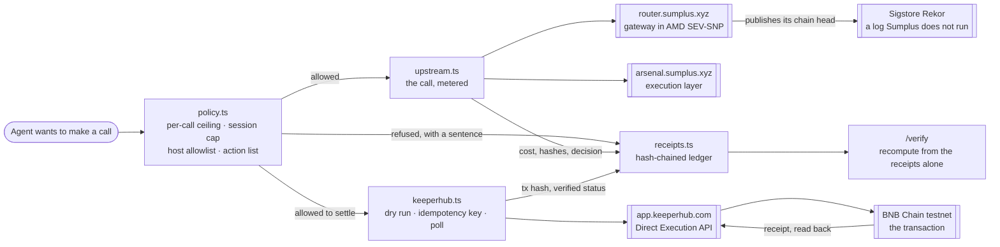

# Sumplus Cashier

An AI agent that spends money, and a record you can audit without trusting the
company that ran it.

**Live: https://sumplus-cashier-production.up.railway.app**

Give an agent a budget and it will spend it. The cashier sits in front of every
call: the policy decides before the money moves, and each call leaves a receipt.
Receipts are chained, so a stranger can recompute the record from the receipts
alone and catch a single edited digit.

## Judge path, five minutes

1. Open the live URL and press **Run a session**. Every call on that page is a
   live request to Sumplus production, not a recording.
2. Two of the seven calls are refused before they run, each with a sentence: one
   exceeds the per-call ceiling, one reaches a host outside the allowlist.
3. Step 5 is the settlement. It runs through KeeperHub and puts a real
   transaction on BNB Chain testnet. The hash on the page is the one you can
   open on an explorer, or read back yourself:

   ```bash
   curl -s https://bsc-testnet-rpc.publicnode.com -H 'content-type: application/json' \
     -d '{"jsonrpc":"2.0","id":1,"method":"eth_getTransactionReceipt","params":["<hash from the page>"]}'
   ```

4. Press **Settle the same work again**. The same work goes back to KeeperHub
   under the key it already derived, and the page reports the account's
   transaction count before and after from a public node. The count does not
   move: a retry replays, it does not pay twice.
5. Open **Verify**, press **Swap the transaction hash** on the settlement
   receipt, and watch the check fail twice.
6. Open **Attestation** to see what the gateway proves about itself, then follow
   the link to Sigstore and find the entry on a log Sumplus does not run.

An earlier settlement from this deployment, if you want one to check before
pressing anything:
[`0xd28bf430…d056d3`](https://testnet.bscscan.com/tx/0xd28bf4309e6cb5e4b4a6ce1acd09827492cce638ead2344e97a0ddbc16d056d3),
status 1, block 131604777.

## What is real here

| Piece | Where it comes from |
|---|---|
| Capability catalogue | `GET https://arsenal.sumplus.xyz/api/categories` |
| Skill search | `GET https://arsenal.sumplus.xyz/api/skills?search=…` |
| Hardware report | `GET https://router.sumplus.xyz/attestation` — mode `sev-snp` |
| Public anchor | `GET https://router.sumplus.xyz/v1/rekor` — Sigstore Rekor |
| Settlement | `POST https://app.keeperhub.com/api/execute/transfer` — dry run, then one broadcast |
| Chain receipt | `GET https://app.keeperhub.com/api/execute/{id}/status` — polled to a verified receipt |

Check the last two without this app:

```bash
curl -s https://router.sumplus.xyz/attestation
curl -s https://router.sumplus.xyz/v1/rekor
```

The gateway runs inside an AMD SEV-SNP confidential machine and publishes the
head of its own call chain to Sigstore Rekor. That log runs outside Sumplus, so
an entry once written cannot be quietly revised by the party it describes.

## Architecture



Two things sit either side of the money. On the left the policy decides, and it
decides before anything leaves. On the right the ledger records, including the
calls that never happened, and the record is checkable by someone who was not
there and who does not have to take Sumplus at its word.

## The receipt chain

Each receipt commits to its fields in a fixed order and to the hash of the
receipt before it:

```
hash = sha256(seq, at, action, target, cost, decision, reason, payloadHash, prevHash)
```

Refusals are receipts too. They cost nothing and still take a place in the
chain, because a spending record with the refusals removed is not a record of
the session. Prompt and response bodies are never stored; receipts carry
hashes, costs and metadata.

## The settlement, through KeeperHub

Once the policy allows a spend, `lib/keeperhub.ts` settles it against the
[Direct Execution API](https://docs.keeperhub.com/api/direct-execution). Four
things there are deliberate:

- **A dry run first.** `simulate: true` signs nothing and broadcasts nothing,
  and it answers whether the transaction would go through. A failed dry run
  stops the settlement instead of broadcasting hopefully.
- **One broadcast, under a key derived from the work.** The idempotency key is
  `sha256(taskId|chainId|recipient|amount|tokenAddress)` with each part
  canonicalised, so address case and a trailing zero in the amount do not change
  it. A retry of the same session derives the same key and replays, rather than
  putting a second transaction on the chain.
- **Polling follows the hint, not the status string.** The response carries a
  poll-interval hint, and an unfamiliar or unconfirmed status is not read as a
  failure.
- **The receipt is read back.** KeeperHub re-fetches the receipt from the chain
  before settling the execution, so the `receipts` array is the proof and
  `transactionHash` is treated as self-reported, which is what the docs say to
  do.

The transaction hash and its verified status go into the receipt chain, so
editing either breaks that receipt and the link the next one holds.

**A retry is checkable on the page, not just in the tests.** `Settle the same
work again` resubmits the same work under the key it already derived, and
reports the account's transaction count from a public node before and after.
Against the live API the same key returns the same execution id and the same
transaction hash with the count unmoved, and a different task id does produce a
second transaction, so the demonstration is not vacuous. The count comes from a
node Sumplus does not run, because "I broadcast nothing" is exactly the claim
that should not be taken from the party making it.

```bash
npm run keeperhub-test
# 45 assertions against a stub of the documented API, covering the dry run
# gate, the idempotency key, polling past an unconfirmed status, the spending
# cap, and the settlement inside the receipt's commitment.
```

The assertions were checked by breaking the code on purpose and watching them
go red. One of those breaks found a hole rather than confirming a guard:
replacing "prefer a verified success" with "take the first receipt" passed
everything, because every scenario handed back exactly one receipt, which makes
the two rules the same answer. Two scenarios where they disagree now exist, and
that break goes red.

## Negative control

A verifier that always says yes is worth nothing.

```bash
npm run negative-control
# 1. Genuine chain -> accepted
# 2. Chain with receipt 0 edited -> rejected
#    receipt 0: contents hash to … , receipt claims …
#    receipt 1: points at … but the receipt before it hashes to …
```

The script asserts both halves of the break: the edited receipt no longer
hashes to what it carries, **and** the receipt after it now points at a hash
nothing produces. Asserting only the first would pass even if links were never
checked, which was confirmed by weakening the verifier on purpose and watching
this script go red.

Run it against the deployment rather than locally:

```bash
npm run negative-control -- https://sumplus-cashier-production.up.railway.app
```

## Run locally

Needs Node 22.

```bash
source ~/.nvm/nvm.sh && nvm use 22
npm install
npm run dev     # http://127.0.0.1:4300
```

## Notes

- Money moves. An allowed spend settles through KeeperHub on BNB Chain testnet,
  and the chain-verified receipt goes into the receipt chain. Every other call
  the cashier makes is a read against production.
- Costs are metered at a published rate card and displayed with enough decimals
  that the shown figure is never below the metered one.
- A ceiling of zero is a stop, never "no ceiling".
- Sessions are held in memory, so a restart clears them. The chain is checked
  from the receipts, so nothing about the check depends on that storage.
