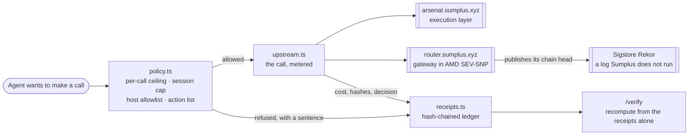

# Sumplus Cashier

An AI agent that spends money, and a record you can audit without trusting the
company that ran it.

**Live: https://sumplus-cashier-production.up.railway.app**

Give an agent a budget and it will spend it. The cashier sits in front of every
call: the policy decides before the money moves, and each call leaves a receipt.
Receipts are chained, so a stranger can recompute the record from the receipts
alone and catch a single edited digit.

## Judge path, five minutes

1. Open the live URL and press **Run a session**. Every call on that page is a
   live request to Sumplus production, not a recording.
2. Two of the five calls are refused before they run, each with a sentence: one
   exceeds the per-call ceiling, one reaches a host outside the allowlist.
3. Open **Verify**, press **Edit this receipt**, and watch the check fail.
4. Open **Attestation** to see what the gateway proves about itself, then follow
   the link to Sigstore and find the entry on a log Sumplus does not run.

## What is real here

| Piece | Where it comes from |
|---|---|
| Capability catalogue | `GET https://arsenal.sumplus.xyz/api/categories` |
| Skill search | `GET https://arsenal.sumplus.xyz/api/skills?search=…` |
| Hardware report | `GET https://router.sumplus.xyz/attestation` — mode `sev-snp` |
| Public anchor | `GET https://router.sumplus.xyz/v1/rekor` — Sigstore Rekor |

Check the last two without this app:

```bash
curl -s https://router.sumplus.xyz/attestation
curl -s https://router.sumplus.xyz/v1/rekor
```

The gateway runs inside an AMD SEV-SNP confidential machine and publishes the
head of its own call chain to Sigstore Rekor. That log runs outside Sumplus, so
an entry once written cannot be quietly revised by the party it describes.

## Architecture



Two things sit either side of the money. On the left the policy decides, and it
decides before anything leaves. On the right the ledger records, including the
calls that never happened, and the record is checkable by someone who was not
there and who does not have to take Sumplus at its word.

## The receipt chain

Each receipt commits to its fields in a fixed order and to the hash of the
receipt before it:

```
hash = sha256(seq, at, action, target, cost, decision, reason, payloadHash, prevHash)
```

Refusals are receipts too. They cost nothing and still take a place in the
chain, because a spending record with the refusals removed is not a record of
the session. Prompt and response bodies are never stored; receipts carry
hashes, costs and metadata.

## Negative control

A verifier that always says yes is worth nothing.

```bash
npm run negative-control
# 1. Genuine chain -> accepted
# 2. Chain with receipt 0 edited -> rejected
#    receipt 0: contents hash to … , receipt claims …
#    receipt 1: points at … but the receipt before it hashes to …
```

The script asserts both halves of the break: the edited receipt no longer
hashes to what it carries, **and** the receipt after it now points at a hash
nothing produces. Asserting only the first would pass even if links were never
checked, which was confirmed by weakening the verifier on purpose and watching
this script go red.

Run it against the deployment rather than locally:

```bash
npm run negative-control -- https://sumplus-cashier-production.up.railway.app
```

## Run locally

Needs Node 22.

```bash
source ~/.nvm/nvm.sh && nvm use 22
npm install
npm run dev     # http://127.0.0.1:4300
```

## Notes

- The cashier is read-only against production. It demonstrates control and
  proof; it does not move funds.
- Costs are metered at a published rate card and displayed with enough decimals
  that the shown figure is never below the metered one.
- A ceiling of zero is a stop, never "no ceiling".
- Sessions are held in memory, so a restart clears them. The chain is checked
  from the receipts, so nothing about the check depends on that storage.
